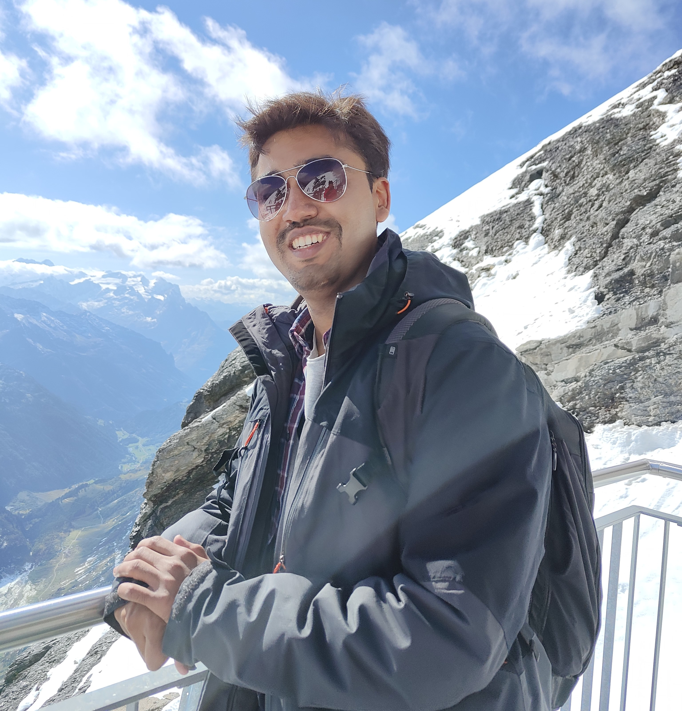

# About Me

  

    Hi, and welcome to my page! I'm currently a PhD student at KTH Royal Institute of Technology, diving deep (literally and figuratively) into the world of Underwater Robotics. My research is centered on multi-agent systems, data fusion, and machine learning, with the goal of advancing underwater exploration technologies.
  

  

    
  

## Current Role

As part of the Underwater Robotics team at KTH, my work focuses on solving challenges in autonomous systems and underwater perception. I'm also fortunate to be a WASP Doctoral Fellow, supported by the Wallenberg AI, Autonomous Systems and Software Program (WASP), which fuels my passion for robotics and AI.

## Research Interests

My PhD is aligned with SMaRC 2.0 – Swedish Maritime Robotics Centre's latest initiative. Through SMaRC, I aim to contribute to the next generation of autonomous underwater systems, working alongside industry leaders like Saab and Ocean Infinity. The combination of academic research and real-world applications is what excites me most about this field.

## Background
I hold a Master's degree in Machine Learning from KTH, where I developed a strong foundation in AI and robotics. My thesis focused on using multi-modal machine learning techniques for fault detection in telecom networks. Previously, I studied Mathematics at the Indian Institute of Science, Bengaluru, where I explored the beauty of mathematical structures and their applications in the real world. It was here that I developed a strong interest in probability theory, vector spaces, calculus and optimization, which laid the groundwork for my future research in AI.

## Gratitude

A special thanks to my supervisor, Professor John Folkesson, and the entire RPL (Robotics, Perception and Learning) division at KTH. Their guidance has been invaluable as I take on this new chapter.

## What's Next?

I'm looking forward to pushing the boundaries of AI in maritime robotics, collaborating with the brilliant minds in the SMaRC community, and tackling the unique challenges that come with exploring the unknown depths of the ocean.
